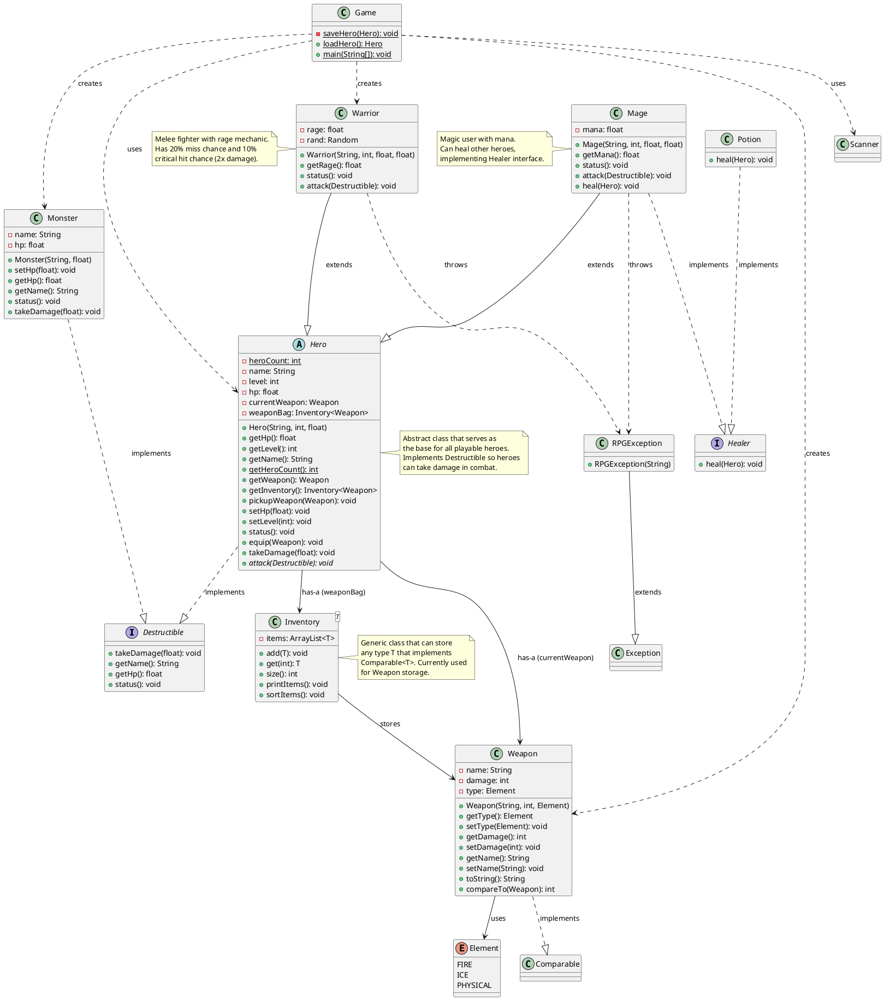

# RPG System - UML Class Diagram

## Class Descriptions

### **Interfaces**

#### `Destructible`
Contract for entities that can be damaged and destroyed in combat.
- **Implementers**: `Hero` (abstract), `Monster`
- **Key Methods**: `takeDamage()`, `getHp()`, `status()`

#### `Healer`
Contract for entities that can restore HP to heroes.
- **Implementers**: `Mage`, `Potion`
- **Key Method**: `heal(Hero target)`

---

### **Abstract Classes**

#### `Hero`
Base class for all playable characters with combat and inventory systems.
- **Attributes**:
  - Static `heroCount` tracks total heroes created
  - Has a `Weapon` (composition)
  - Has an `Inventory<Weapon>` for weapon storage
- **Key Features**:
  - Abstract `attack()` method (implemented by subclasses)
  - Weapon management (equip, pickup)
  - HP validation (can't go below 0)
- **Subclasses**: `Warrior`, `Mage`

---

### **Concrete Classes**

#### `Warrior extends Hero`
Melee fighter with rage-based combat mechanics.
- **Special Attribute**: `rage` (float)
- **Combat Features**:
  - 20% miss chance
  - 10% critical hit chance (2x damage)
  - Uses random number generation for combat rolls
- **Throws**: `RPGException` for invalid attacks

#### `Mage extends Hero implements Healer`
Spellcaster with mana and healing abilities.
- **Special Attribute**: `mana` (float)
- **Dual Role**:
  - Can attack enemies with spell damage
  - Can heal allies (+50 HP)
- **Throws**: `RPGException` for invalid attacks

#### `Monster implements Destructible`
Enemy entities for heroes to battle.
- **Simple Design**: Name and HP only
- **No Weapon System**: Uses fixed damage values
- **Combat**: Can be attacked by heroes

#### `Weapon implements Comparable<Weapon>`
Equipment items that determine attack damage.
- **Attributes**:
  - `name`: Weapon identifier
  - `damage`: Attack power (int)
  - `type`: Element (FIRE, ICE, PHYSICAL)
- **Features**:
  - Sortable by damage (ascending)
  - Custom `toString()` for inventory display

#### `Potion implements Healer`
Consumable item that restores hero HP.
- **Healing Amount**: +100 HP
- **Usage**: Can be used through `Healer` interface

#### `Inventory<T extends Comparable<T>>`
Generic container for storing and managing items.
- **Type Parameter**: Must implement `Comparable`
- **Features**:
  - Add/get items
  - Sort items by natural ordering
  - Print formatted inventory list
- **Current Use**: Stores `Weapon` objects

---

### **Enums**

#### `Element`
Damage/element types for weapons and attacks.
- **Values**: `FIRE`, `ICE`, `PHYSICAL`

---

### **Exceptions**

#### `RPGException extends Exception`
Custom checked exception for game logic errors.
- **Use Cases**:
  - Attacking self
  - Attacking dead enemies
  - Missing weapon
- **Handling**: Forces try-catch in calling code

---

### **Utility Classes**

#### `Game`
Main game controller with save/load system.
- **Static Methods**:
  - `saveHero()`: Writes hero data to `Data/save.txt`
  - `loadHero()`: Reads hero data from file
  - `main()`: Game loop and battle system
- **Save Format**: Key:Value pairs (Name, Class, Level, HP, Weapon)

---

## Design Patterns Used

1. **Inheritance Hierarchy**
   - `Hero` → `Warrior`, `Mage`
   - Enables code reuse and polymorphism

2. **Interface Segregation**
   - `Destructible`: Combat-capable entities
   - `Healer`: Healing-capable entities
   - `Comparable`: Sortable items

3. **Composition over Inheritance**
   - Hero **has-a** Weapon (not is-a)
   - Hero **has-a** Inventory

4. **Polymorphism**
   - Different `attack()` implementations
   - Multiple `Healer` implementations (Mage, Potion)

5. **Generics**
   - `Inventory<T>` for type-safe collections

6. **Static Members**
   - `Hero.heroCount` for class-level tracking
   - `Game` static methods for utility functions

---

## Key Relationships

- **Hero → Weapon**: Composition (1:1 current weapon)
- **Hero → Inventory**: Composition (1:1 weapon bag)
- **Inventory → Weapon**: Association (1:many)
- **Warrior/Mage → Hero**: Inheritance
- **Mage → Healer**: Interface implementation
- **Hero/Monster → Destructible**: Interface implementation
- **Game → Hero/Monster/Weapon**: Dependency (creates/uses)

---

## Future Enhancements

Potential additions to the architecture:
- **Armor class**: Defensive equipment
- **Skill system**: Special abilities for heroes
- **Quest system**: Objectives and rewards
- **Multiple enemies**: Battle against groups
- **Experience points**: Level progression system
- **Item shop**: Buy/sell equipment
- **Status effects**: Buffs, debuffs, DoT
